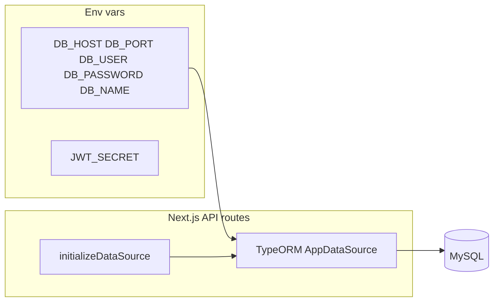

# Database and local configuration setup

## What the app uses

- **Database**: MySQL (driver: `mysql2`), configured in `[src/config/db.ts](src/config/db.ts)` via `AppDataSource`.
- **Schema in dev**: `synchronize: process.env.NODE_ENV !== "production"` — on first successful connection in development, TypeORM creates/updates tables from the entities under `[src/api/entities/](src/api/entities/)` (User, Person, Relationship, FamilyTree, gamification tables, etc.). There are **no** checked-in migrations or `typeorm` CLI scripts beyond the package script pointing at `typeorm-ts-node-esm` with no config file.
- **Auth**: Custom JWT in `[src/lib/jwt.ts](src/lib/jwt.ts)` (`JWT_SECRET`; unsafe default `your-secret-key` if unset). Sign-in/up routes call `initializeDataSource()` before DB access.

```19:33:src/config/db.ts
export const AppDataSource = new DataSource({
  type: "mysql",
  host: process.env.DB_HOST || "localhost",
  port: Number(process.env.DB_PORT) || 3306,
  username: process.env.DB_USER || "root",
  password: process.env.DB_PASSWORD || "",
  database: process.env.DB_NAME || "ukoo",
  entities: [
    User, Person, Relationship, FamilyTree, FamilyTreeMember,
    MergeRequest, LifeEvent, Clan,
    UserXP, XPEvent, Achievement, UserAchievement, Quest, UserQuest,
  ],
  synchronize: process.env.NODE_ENV !== "production",
  logging: ["error", "schema"],
});
```

## Required local steps (no code changes)

1. **MySQL is already running** — use your existing instance (typically `localhost:3306`).
2. **Create an empty database** whose name matches `DB_NAME` if it does not exist (your repo may already have a root-level `[.env](.env)` with `DB_*`). Example: `CREATE DATABASE your_db_name CHARACTER SET utf8mb4 COLLATE utf8mb4_unicode_ci;`
3. **Set credentials** in `.env`: `DB_HOST`, `DB_PORT`, `DB_USER`, `DB_PASSWORD`, `DB_NAME`. Defaults in code match a typical local install (`root` / empty password / database `ukoo` if vars omitted).
4. **Set `JWT_SECRET`** to a long random string (required for sensible auth in any shared or deployed environment).
5. **Install and run**: `npm install`, then `npm run dev`. Trigger any API route that calls `initializeDataSource()` (e.g. signup or `/api/persons`) once; watch the server log for schema sync errors.

**Email (optional)**: `[src/api/services/mail/mail.service.ts](src/api/services/mail/mail.service.ts)` uses `SMTP_USER`, `SMTP_PASS`, and `MAIL_FROM` if you enable outbound mail.

## Gamification seed data

Achievement rows are inserted lazily when authenticated users hit `[src/app/api/gamification/achievements/route.ts](src/app/api/gamification/achievements/route.ts)` (loops `ACHIEVEMENT_SEEDS`). No separate DB seed command is required for the core family-tree flows.

## Legacy / inconsistent pieces to be aware of

- `**[src/shared/common.ts](src/shared/common.ts)`** + `**[src/app/api/mysql/students/route.ts](src/app/api/mysql/students/route.ts)`**: This route uses `host_dev`, `port_dev`, `user_dev`, `password_dev`, `database_dev` (development) or `host`, `port`, etc. (production)—**not** the `DB_*` variables. It queries `students.std_profile`, which is unrelated to the family-tree entities. For local family-tree work you can ignore this route unless you intentionally wire it to another database.
- `**[src/middleware.ts](src/middleware.ts)`** imports `initializeDataSource` but does not call it (harmless dead import; optional cleanup later).

## Recommended repo hardening (optional implementation after you approve)

- Add `**[.env.example](.env.example)`** listing `DB_*`, `JWT_SECRET`, and optional SMTP vars (no secrets), and ensure `**.env` stays out of git** (today `[.gitignore](.gitignore)` only ignores `.env*.local`; if `.env` is committed, remove it from tracking and use `.env.local` or local-only `.env`).
- Add `**docker-compose.yml`** with a `mysql` service only if you want a reproducible DB for teammates or CI (you can skip this while using your existing local MySQL).
- Optionally **refactor `GetDBSettings`** to read the same `DB_*` names as TypeORM (or delete the students route if it is dead), so one env block serves the whole app.




