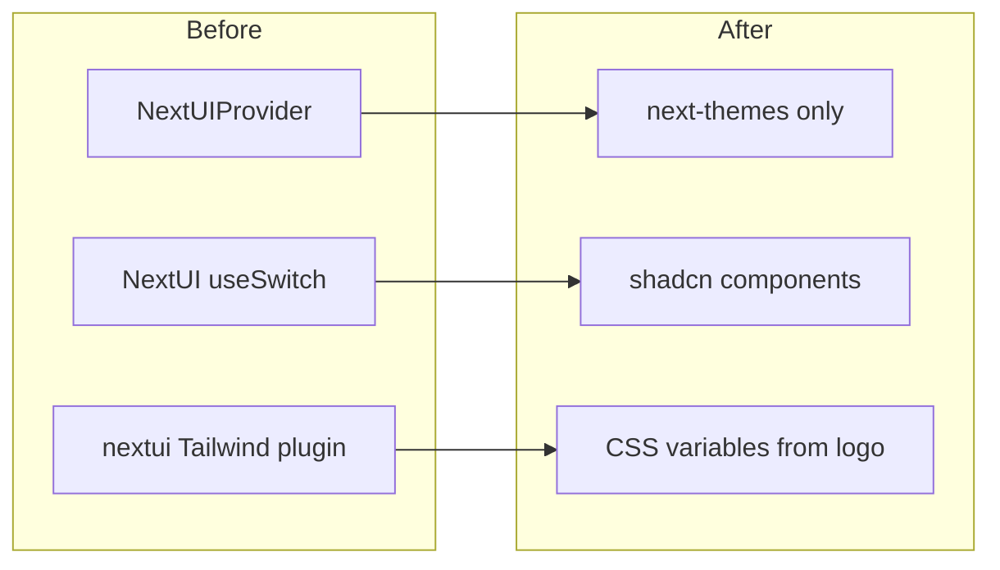

# shadcn/ui migration and logo-based theme

## Current state

- **NextUI in code**: only `[src/app/providers.tsx](src/app/providers.tsx)` (`NextUIProvider`), `[src/components/theme-switch.tsx](src/components/theme-switch.tsx)` (`useSwitch` from `@nextui-org/switch`), and `[src/components/counter.tsx](src/components/counter.tsx)` (`Button` — **not imported anywhere**).
- **NextUI in build**: `[tailwind.config.js](tailwind.config.js)` uses `import { nextui } from '@nextui-org/theme'` and `plugins: [nextui()]`, plus content scan of `@nextui-org/theme/dist/`**.
- **Rest of the app**: feature pages already use **plain Tailwind** (`stone-`*, `amber-*`, native `<input>` / `<button>`), not NextUI components.
- **Template leftovers**: `[src/components/primitives.ts](src/components/primitives.ts)` uses `text-default-600` on `subtitle` — a **NextUI token** that will break once the plugin is removed. Used by docs/blog/about/pricing pages via `title` import.
- **Logo colors** (sampled from the vector artwork in `[public/logos/uk-icon-logo-wt.svg](public/logos/uk-icon-logo-wt.svg)`, which matches the colored mark in `uk-icon-logo.png`):  
  - Teals: `#215563`, `#49838F`  
  - Warm accents: `#BB885E`, `#CDB185`, `#D0B287`  
  - Dark neutrals: `#261516`, `#332429`, `#3A2F32`

## 1. Initialize shadcn/ui for this repo

- Run the official init (Tailwind 3 + `tailwindcss-animate` as prompted) and point generated UI to `**src/components/ui`** via `components.json` (`aliases` aligned with existing `@/`* → project root, e.g. `"components": "@/src/components"`, `"ui": "@/src/components/ui"`).
- Add `[src/lib/utils.ts](src/lib/utils.ts)` with `cn()` (`clsx` + `tailwind-merge`) if not created by CLI.
- Update `[tailwind.config.js](tailwind.config.js)`: **remove** `nextui` import/plugin and NextUI `content` entry; **add** shadcn-style `darkMode: 'class'`, `theme.extend` for radius and CSS variable–driven colors, and `tailwindcss-animate` plugin.
- Replace legacy CSS variables in `[src/styles/globals.css](src/styles/globals.css)` with shadcn’s `@layer base` + `:root` / `.dark` **HSL** variables (`--background`, `--foreground`, `--primary`, `--secondary`, `--accent`, `--muted`, `--border`, `--ring`, etc.) derived from the logo palette (see table below).

**Suggested token mapping (dark-first app):**

| Token          | Role               | Source (conceptual)                      |
| -------------- | ------------------ | ---------------------------------------- |
| `--background` | App shell          | `#1a1415` / `#261516` range              |
| `--card`       | Panels             | `#261516`–`#332429`                      |
| `--primary`    | CTAs, links, focus | `#49838F` (teal); hover slightly lighter |
| `--secondary`  | Secondary actions  | `#215563` (deep teal)                    |
| `--accent`     | Highlights, badges | `#CDB185` / `#BB885E`                    |
| `--muted`      | Subtle UI          | `#3A2F32` with muted foreground          |
| `--ring`       | Focus rings        | align with `--primary`                   |

Light mode: off-white / warm gray background, same teal primary, gold accent — keep contrast AA-friendly.

## 2. Remove NextUI

- `[package.json](package.json)`: remove all `@nextui-org/`* packages (and `@react-aria/ssr` / `@react-aria/visually-hidden` if nothing else uses them after theme switch rewrite).
- `[src/app/providers.tsx](src/app/providers.tsx)`: drop `NextUIProvider` and the `RouterConfig` module augmentation for `@react-types/shared`; keep `**next-themes` `ThemeProvider`** only.
- Delete or rewrite `[src/components/counter.tsx](src/components/counter.tsx)` (unused — safe to delete).
- Optionally remove `[NextUILogo](src/components/icons.tsx)` if unused (grep before delete).

## 3. Replace NextUI-only UI with shadcn

- **Theme switch**: Reimplement `[src/components/theme-switch.tsx](src/components/theme-switch.tsx)` using shadcn **Switch** (or Radix switch from the shadcn bundle) + existing sun/moon icons; preserve `next-themes` toggle behavior. No `useSwitch` / VisuallyHidden from NextUI.
- **Primitives**: Update `[src/components/primitives.ts](src/components/primitives.ts)`: replace `text-default-600` with `text-muted-foreground` (or shadcn token class). Optionally add a **logo-aligned** `title` gradient variant using `#49838F` → `#CDB185` for marketing headings.

## 4. Adopt shadcn on “necessary” surfaces (first pass)

Prioritize files that define product UX and repeat patterns:

| Area      | Files                                                                                                                                 | shadcn pieces                                                                                    |
| --------- | ------------------------------------------------------------------------------------------------------------------------------------- | ------------------------------------------------------------------------------------------------ |
| Auth      | `[src/app/(app)/auth/login/page.tsx](src/app/(app)`/auth/login/page.tsx), `[register/page.tsx](src/app/(app)`/auth/register/page.tsx) | `Button`, `Input`, `Label`, `Card`                                                               |
| Profile   | `[src/app/(app)/profile/page.tsx](src/app/(app)`/profile/page.tsx)                                                                    | `Input`, `Label`, `Button`, `Card`, `Select` (person link)                                       |
| Shell     | `[src/components/navbar.tsx](src/components/navbar.tsx)`                                                                              | `Button` (ghost/outline) for mobile menu / sign out; optional `DropdownMenu` for user menu later |
| Marketing | `[src/app/page.tsx](src/app/page.tsx)`                                                                                                | `Button` for CTAs (optional `Card` for feature grid)                                             |

**Not required in v1** (already custom Tailwind, low ROI): React Flow nodes (`[PersonNode.tsx](src/components/tree/PersonNode.tsx)`, etc.), `[LevelUpModal.tsx](src/components/gamification/LevelUpModal.tsx)` — can migrate to `Dialog` in a follow-up.

## 5. Verification

- `npm run build` and spot-check `/auth/login`, `/dashboard`, `/profile`, and one tree/person page for regressions.
- Confirm dark/light toggle still works and new CSS variables apply (primary/accent visible on buttons and focus rings).

## Notes

- **Favicon / metadata** in `[src/app/layout.tsx](src/app/layout.tsx)` already uses logo assets; no change required for shadcn.
- Email template (`[baseTemplate.ts](src/api/services/mail/baseTemplate.ts)`) can stay on inline colors for now, or later align header/footer hex with the same palette for consistency.

