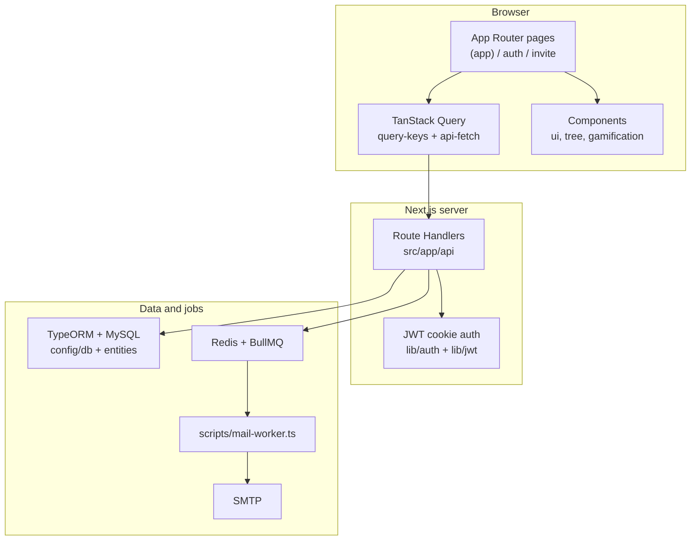
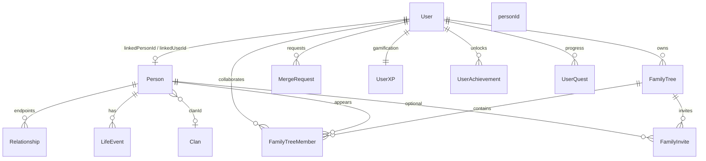

# Technical features guide

Living reference for **what the product does in code**, how major capabilities connect, and where to extend the system when adding features. Keep this file honest when behavior or APIs change; pair updates with [`docs/ARCHITECTURE.md`](ARCHITECTURE.md) (stack, boundaries, API index, data model summary). The Cursor rule [`.cursor/rules/architecture-doc.mdc`](../.cursor/rules/architecture-doc.mdc) describes when to touch architecture docs.

## How to use this document

- **Adding a feature:** Find the nearest domain section below, follow the UI → API → service → entity links, then add your surface in the same layers.
- **Changing contracts:** Update the relevant Route Handler under `src/app/api/`, any TanStack Query keys in `src/lib/query-keys.ts`, and the **UI ↔ API** table in this file if routes or flows change.
- **New cross-cutting concern:** Note it under [Cross-cutting](#cross-cutting-concerns) and in `ARCHITECTURE.md` under **Cross-cutting concerns**.

## System at a glance

## Domain features and relationships

### Identity and access

| Capability | Role | Key code |
|------------|------|----------|
| Registration / login / logout | Creates session via JWT in HTTP-only cookie; middleware keeps signed-in users off login/register | `src/app/api/auth/signup`, `signin`, `signout`; pages `src/app/auth/register`, `login`; `src/middleware.ts` |
| Current user profile | Read/update name, photo, password, optional link to genealogy person | `src/app/api/users/me`, `users/me/password`; `src/hooks/useAuth.ts` |
| User directory (admin) | Listing users when authorized | `src/app/api/users/route.ts`; `(app)/admin` |

**Relations:** `User` holds `linkedPersonId` and `phoneHash` for genealogy linking. JWT payload carries user `id` and optional `role`; `requireAuth` / `getAuthUser` in `src/lib/auth.ts` gate Route Handlers.

### Persons (genealogy records)

| Capability | Role | Key code |
|------------|------|----------|
| CRUD persons | Core profile: names, dates, bio, clan fields, privacy, verification; directory list filtered by `canViewPerson` | `src/app/api/persons`, `persons/[id]`; entities `Person` |
| Shareable identity | Unique `personCode` for “this node = this person” across trees | `Person` entity; used in discovery flows |
| Phone-based auto-link | `phoneHash` on `User` and `Person` for matching accounts to records | `User`, `Person`; see `src/api/services/user.service.ts` for linkage behavior |
| User ↔ person | `Person.linkedUserId` and `User.linkedPersonId` tie an account to a profile | Person detail/edit pages; invite accept flow |

**Relations:** Persons join **trees** via `FamilyTreeMember`, connect to **clans** via optional `clanId`, participate in **relationships** and **life events**, appear in **merge requests**, and receive **gamification** XP when users perform qualifying actions.

### Family trees and membership

| Capability | Role | Key code |
|------------|------|----------|
| Tree CRUD | Owner/admin manage settings & delete; visibility, optional `rootPersonId`, cover image | `FamilyTree`; `src/app/api/trees`, `trees/[id]` |
| Members | Junction: `treeId`, `personId`, optional `userId`, `role`, `isRootPerson`; add/remove by owner or EDITOR | `FamilyTreeMember`; `src/app/api/trees/[id]/members` |
| Atomic create+attach | `POST …/members` with `{ person: { firstName, lastName, … } }` creates person + membership in one transaction | same members route |
| Capability flags | `GET /api/trees/[id]` returns `myRole`, `canEdit`, `canManage` for UI gating | `canEditTree` / `canManageTree` in `src/lib/permissions.ts` |
| Tree visualization | React Flow + dagre hierarchical layout (couple-junction model) | `src/components/tree/FamilyTreeViewer.tsx`, `PersonNode.tsx`, `CoupleNode.tsx` |

**Relations:** Trees are owned by a `User` (`ownerUserId`). Members link **Person** rows into a tree; collaborator users are optional on each member row. Invite accept grants `EDITOR`. **Invites** (send) stay owner-managed.

### Relationships

| Capability | Role | Key code |
|------------|------|----------|
| Typed edges | Parent/child, spouse, partner, sibling, extended types (e.g. co-wife, levirate) with status and marriage metadata | `Relationship` entity; `src/app/api/relationships`, `relationships/[id]` |
| Unlink / request removal | Direct unlink if admin, rel creator, or linked/steward of the person page; else propose removal for review | `canUnlinkRelationship`, `canReviewRelationshipRemoval`; `DELETE …/relationships/[id]?personId=`; `ProposedEdit` kind `remove_relationship`; `/proposals` |
| Inference | After certain relationship creates, derives consistent sibling/parent edges | `src/api/services/relationship.inference.ts` (invoked from relationship API paths) |

**Relations:** Relationships only reference **Person** ids (`personAId`, `personBId`). They drive tree layout and gamification (`XPEventType.ADD_RELATIONSHIP`, etc.).

### Life events

| Capability | Role | Key code |
|------------|------|----------|
| Timeline entries | Events tied to a person (dates, types, narrative) | `LifeEvent`; `src/app/api/life-events`, `life-events/[id]` |

**Relations:** Always scoped to a **Person**; awards XP via gamification service when applicable.

### Clans (lineage groups)

| Capability | Role | Key code |
|------------|------|----------|
| Clan directory and detail | Cultural metadata: totem, praise poem, region, verification flag | `Clan`; `src/app/api/clans`, `clans/[id]`; pages under `(app)/clans` |
| Person ↔ clan | Optional `Person.clanId` | Person forms and detail |

**Relations:** orthogonal to trees: a person can reference a clan without belonging to a particular tree layout.

### Collaboration: invites

| Capability | Role | Key code |
|------------|------|----------|
| Create invite | Email + token + `treeId`, optional `personId`, expiry | `FamilyInvite`; `src/app/api/invites` |
| Accept invite | Claim node, steward, membership, relatives preview, auto-merge + pending merges | `src/app/api/invites/accept`; page `src/app/invite/accept` |

**Relations:** Bridges **User** and **FamilyTree** (and optionally **Person**). Email delivery uses **mail queue** when invites notify by email.

### Shared graph and growth

| Capability | Role | Key code |
|------------|------|----------|
| Relatives viewport | BFS over relationships from linked person / tree members | `getRelatives`; `GET /api/me/relatives`; trees GET |
| Stewardship | Direct edit rights on a person | `PersonSteward`; `src/lib/permissions.ts` |
| Visibility | `public` / `connections` / `stewards` on `Person` | person GET/PATCH; create defaults |
| Proposed edits | Non-steward person PATCH → field-edit inbox; non-privileged relationship DELETE → remove-relationship inbox | `ProposedEdit` (`field_edit` \| `remove_relationship`); `/proposals`; `proposed-edits/[id]/review` |
| Auto / confirm merge | Deterministic auto-merge on invite; self-serve confirm | `merge.service`; `persons/merge/confirm`; `MergeReviewDialog` |
| Connection requests | Connect people **outside** your graph or merge duplicates | `ConnectionRequest`; `/connections` (relatives view-only; connectable search/matches) |
| Discovery | Matches vs nearby relatives (inferred kinship) | `GET /api/me/suggestions` (`relativesNearby`, `reachablePersonIds`); dashboard |
| Merge undo | Admin/performer undo from audit | `MergeAudit`; admin Audits tab |

Design doc: [`docs/GRAPH_GROWTH_DESIGN.md`](GRAPH_GROWTH_DESIGN.md).

### Workflow: merge requests

| Capability | Role | Key code |
|------------|------|----------|
| Proposals | Duplicate person merge or family-tree merge with evidence | `MergeRequest`; `src/app/api/merge-requests`, `merge-requests/[id]` |
| Review | Approve/reject with notes; drives gamification on approval | `merge-requests/[id]/review` |

**Relations:** References two **Person** or two **FamilyTree** records plus optional `connectingPersonId`. Status changes interact with **gamification** (e.g. merge approved XP).

### Gamification

| Capability | Role | Key code |
|------------|------|----------|
| XP, levels, streaks | Central award + level calculation | `UserXP`, `XPEvent`, `XPEventType`; `src/api/services/gamification/gamification.service.ts` |
| Achievements / quests | Seeded definitions; per-user unlock and progress | `Achievement`, `UserAchievement`, `Quest`, `UserQuest`; seeds in `achievements.seed.ts`, `quests.seed.ts` |
| HTTP surface | Profile, activity feed, lists, leaderboard | `src/app/api/gamification/*` |
| UI | Badges, XP bar, quest cards, level-up modal | `src/components/gamification/*`; pages `quests`, `achievements`, `leaderboard`, `dashboard` |

**Relations:** Mostly keyed by **User** id. Domain actions (person, relationship, tree, clan, merge, invite, etc.) call into `gamification.service` from Route Handlers or services where XP should apply.

### Email and background delivery

| Capability | Role | Key code |
|------------|------|----------|
| Enqueue | Producers add jobs to Redis | `src/queue/mail.queue.ts` (`enqueueMail`) |
| Worker | Separate process sends SMTP | `npm run worker:mail` → `scripts/mail-worker.ts` |
| Templates | HTML body fragments only; `deliverMail` wraps once via `baseTemplate` | `src/api/services/mail/` — callers must not pre-wrap |

**Relations:** Not on the hot path for every request; APIs enqueue work instead of blocking on SMTP when queueing is used.

### Miscellaneous HTTP

| Path | Notes |
|------|--------|
| `src/app/api/route.ts` | Health or generic API entry (see implementation) |
| `src/app/api/mysql/students/route.ts` | Sample/demo MySQL usage; not core genealogy domain |

## UI ↔ API map (main app)

| App area (`src/app/(app)/…`) | Primary APIs (`src/app/api/…`) |
|------------------------------|--------------------------------|
| `dashboard` | Gamification; trees/persons; `me/relatives`; `me/suggestions` |
| `trees`, `trees/new`, `trees/[id]` | `/api/trees`, `/api/trees/[id]`, `/api/trees/[id]/members` |
| `persons`, `persons/new`, `persons/[id]`, `edit` | `/api/persons`, `/api/persons/[id]`, `/api/persons/suggestions` |
| `connections` | `/api/connection-requests` (enriched names), `…/respond`, `/api/me/suggestions`, `/api/persons?search` |
| `proposals` | `/api/me/proposed-edits/incoming`, `/api/proposed-edits/[id]/review` |
| `merge-requests`, `merge-requests/new` | `/api/merge-requests`, `/api/merge-requests/[id]`, `…/review` |
| `clans`, `clans/new`, `clans/[id]` | `/api/clans`, `/api/clans/[id]` |
| `quests`, `achievements`, `leaderboard` | `/api/gamification/quests`, `achievements`, `leaderboard`, `profile`, `activity` |
| `profile` | `/api/users/me`, `users/me/password`, `users/me/photo` |
| `admin` | `/api/users`, merge reviews, `/api/merge-audits` |

Auth pages: `src/app/auth/login`, `register` → `/api/auth/signin`, `signup`. Invite: `src/app/invite/accept` → `/api/invites/accept`.

Life events and relationships are often edited in context of a person or tree; their APIs are `/api/life-events`, `/api/relationships` (and id routes).

## Cross-cutting concerns

| Concern | Location |
|---------|----------|
| Auth guest-page redirect | `src/middleware.ts` (login/register → dashboard when JWT cookie valid) |
| JSON success/error envelope | `src/lib/ApiResponse.ts`, `src/lib/ApiError.ts` |
| Browser `fetch` helpers | `src/lib/api-fetch.ts` |
| TanStack Query keys | `src/lib/query-keys.ts` (invalidate alongside new mutations) |
| App shell (nav) | `src/app/(app)/layout.tsx`, `src/components/navbar.tsx` |
| Theme / providers | `src/app/providers.tsx`, `src/components/theme-switch.tsx` |
| Global styles / tokens | `src/styles/globals.css`, Tailwind config |

## Entity dependency (conceptual)

## Change log (technical features)

Newest first.

- **2026-07-24** — Family tree viewer uses dagre auto-layout with couple-junction ranking; redundant sibling diagonals dropped (only orphan sibling links drawn as smoothstep).
- **2026-07-24** — Tree creator/owner can rename a tree from the tree viewer (pencil → dialog).
- **2026-07-24** — `/trees` cards show small “Created by” owner name.
- **2026-07-24** — Merge requests list shows person/tree display names (API enrichment), not only IDs.
- **2026-07-24** — Relationship unlink: direct for creator/steward/linked of context person; otherwise `remove_relationship` proposal reviewed on `/proposals`.
- **2026-07-24** — Confirmations use shared Radix `AlertDialog` (relationship remove; admin merge approve/reject/undo); warning copy uses `Alert`.
- **2026-07-24** — Avatar initials ignore quoted nicknames (e.g. `Augustine Ochokolo "Agusto"` → AO).
- **2026-07-24** — Dashboard: “Needs your attention” + link-profile CTA; “Your people” lists immediate family first with kinship labels; Explore strip for achievements/quests/leaderboard.
- **2026-07-24** — Middleware redirects authenticated users away from `/auth/login` and `/auth/register`; cookie lifetime matches JWT (24h).
- **2026-07-24** — Branded not-found page and shared `NotFoundView` for missing person/tree/clan routes.
- **2026-07-24** — Relatives in the graph can view `stewards`/`connections` people; `isPrivate` hard-hides from everyone except stewards (edit UI Switch).
- **2026-07-24** — Tree viewport shows all direct members to collaborators even if a person's global visibility (e.g. `stewards`) would otherwise hide them.
- **2026-07-24** — People directory hides people you cannot view; person detail shows forbidden immediately (no React Query retry on 403).
- **2026-07-24** — Password inputs: shared show/hide toggle (`PasswordInput`) on auth, invite accept, and profile.
- **2026-07-24** — Connections kinship UX: nearby relatives show inferred labels (e.g. Grandmother) without Connect; Connect reserved for people outside the graph + possible merges; full direct `RelationshipType` picker.
- **2026-07-24** — All date fields use shared `DatePicker` (person create/edit birth & death; person detail union & life-event dates).
- **2026-07-24** — Tree EDITOR can add/remove members; atomic person+membership create; tree UI gated by `canEdit` / `canManage`.
- **2026-07-24** — `/connections`: discover + search by name (no raw person IDs); inbox shows display names via enriched connection-request API.
- **2026-07-24** — Invite/connection emails: stop double-wrapping `baseTemplate` (duplicate MY UKOO header); callers pass body HTML only.
- **2026-07-24** — Shared graph growth (all phases): claim-on-invite, relatives viewport, auto-merge, stewardship/proposed edits, connection requests, discovery, visibility defaults, merge undo. See `GRAPH_GROWTH_DESIGN.md`.
- **2026-07-24** — User profile photo sources: upload, external URL, or DiceBear Big Ears (`ProfilePhotoField`); stored on `User.profilePhotoUrl`.
- **2026-07-24** — Person edit: fixed gender/status select prefilling (hydrate form before rendering Radix Selects).
- **2026-07-24** — UI stack: Radix Themes root theme (teal/sand) with existing `src/components/ui` Primitives wrappers; no user-facing flow change.
- **2026-04-21** — Initial `docs/TECHNICAL_FEATURES.md`: feature map, relationships, UI↔API table, cross-cutting index.
